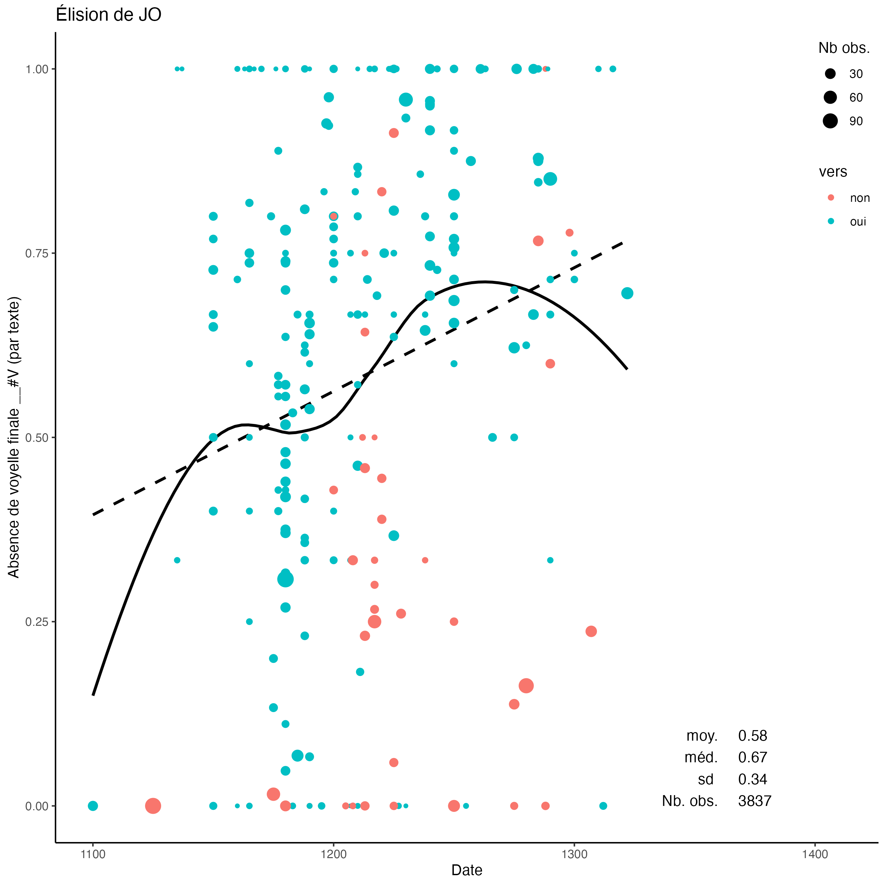
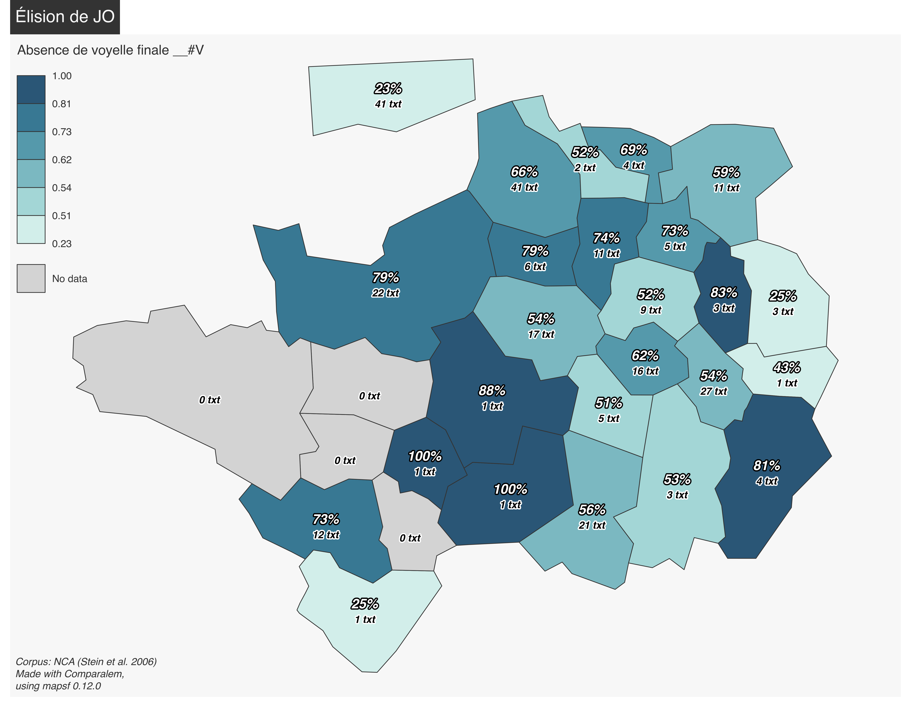

# Comparalem

Comparalem is an R script intended for the study of binary linguistic variation in big, diachronic corpora.

The first version of Comparalem has been developped by Timothée Premat for his PhD thesis. This is version 2 alpha. It is deposited here in relation to the following talk:

> Premat, Timothée (2025). "L'élision de JO dans le NCA". Talk at the congress SIDF 25, Grenoble, 21 May 2025.

## How to use

Using this script usually goes along the following steps:

1. Extract data from the corpus (e.g., using TXM)
2. Finding the lemmas that are subject to the target variation (this is ```main_pre-processing.r```) (this step is optional)
3. Treating the data and mapping the variation (this is ```main.r```)

See ```Instructions.md``` for more details. For work on a single lemma (such as _jo_ in the quoted talk, skip step 2)

### Requisites

This script requires a recent version of R and of some packages; the needed packages
are automatically installed if missing.

On UNIX-based devices, this script uses X11 for user input (```tcltk``` package).
Find the right installation for your device:
- Linux: X11 should be available by default, if not:
    - Debian/Ubuntu: ```sudo apt install xorg```
	- CentOS/RHEL: ```sudo yum install xorg-x11-server-Xorg```
	- (this has not been tested by us, proceed at your own risks)
- MacOS: https://www.xquartz.org
- Windows: you don't need X11

## How to cite

> Premat, Timothée (2025). Comparalem, version 2-alpha. Url: <https://github.com/TimotheePremat/Comparalem_v2_SIDF25.git>

This is delivered under GNU-GPL 3 licence. A stable version of this v2 is planned. Please let me know if you use this; I'd be curious!

## Output examples

Based on datasets for tokens and metadata for texts, Comparalem produces things such as the following graphs. They represent the _j_ / _jo_ ('I') variation in a corpus of Old French texts. You'll find outputs for this dataset in ```Graphs``` and ```Tables``` folders.




